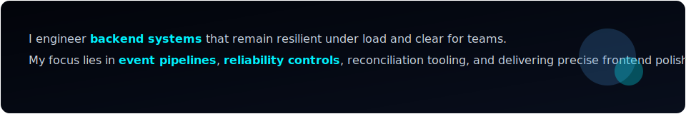
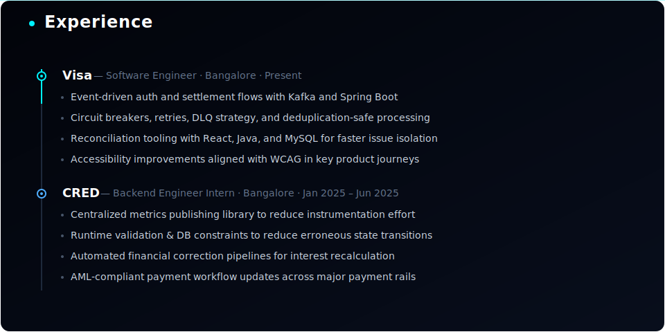

  

   
  <a href="https://portfolio-one-kappa-34.vercel.app/" target="_blank" rel="noopener noreferrer"><strong>Portfolio</strong></a>
  &nbsp;&nbsp;✦&nbsp;&nbsp;
  <a href="https://drive.google.com/file/d/19Swe4AwPU7w7m1_vktRY_tho8P2VsaXI/view?usp=sharing" target="_blank" rel="noopener noreferrer"><strong>Resume</strong></a>
  &nbsp;&nbsp;✦&nbsp;&nbsp;
  <a href="https://www.linkedin.com/in/gourab-singha-6a0690245/" target="_blank" rel="noopener noreferrer"><strong>LinkedIn</strong></a>
  &nbsp;&nbsp;✦&nbsp;&nbsp;
  <a href="https://github.com/gourabsingha1" target="_blank" rel="noopener noreferrer"><strong>GitHub</strong></a>
  &nbsp;&nbsp;✦&nbsp;&nbsp;
  <a href="mailto:gaurabsingha16@gmail.com" target="_blank" rel="noopener noreferrer"><strong>Email</strong></a>
   
   

  
    
  
    
  
    
  

&nbsp;&nbsp;&nbsp;&nbsp;&nbsp;&nbsp;&nbsp;&nbsp;&nbsp;&nbsp;&nbsp;&nbsp;&nbsp;&nbsp;&nbsp;&nbsp;&nbsp;&nbsp;&nbsp;&nbsp;

&nbsp;&nbsp;&nbsp;&nbsp;&nbsp;&nbsp;&nbsp;&nbsp;&nbsp;&nbsp;&nbsp;&nbsp;&nbsp;&nbsp;&nbsp;&nbsp;&nbsp;&nbsp;&nbsp;&nbsp;&nbsp;&nbsp;&nbsp;&nbsp;

  

&nbsp;&nbsp;&nbsp;&nbsp;&nbsp;&nbsp;&nbsp;&nbsp;&nbsp;&nbsp;&nbsp;&nbsp;

  
    
  <picture>
    <source media="(prefers-color-scheme: dark)" srcset="./github-contribution-grid-snake-dark.svg">
    
  </picture>
   

