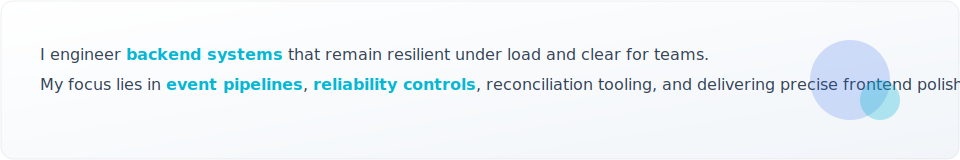
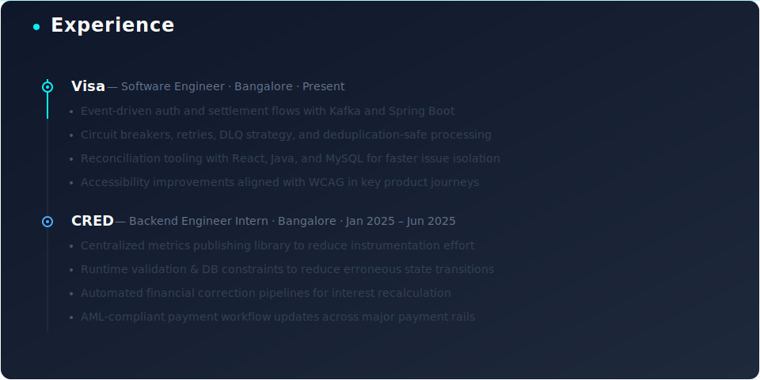

  <picture>
    <source media="(prefers-color-scheme: dark)" srcset="./assets/hero.svg">
    
  </picture>

   
  <a href="https://portfolio-one-kappa-34.vercel.app/" target="_blank" rel="noopener noreferrer"><strong>Portfolio</strong></a>
  &nbsp;&nbsp;✦&nbsp;&nbsp;
  <a href="https://drive.google.com/file/d/19Swe4AwPU7w7m1_vktRY_tho8P2VsaXI/view?usp=sharing" target="_blank" rel="noopener noreferrer"><strong>Resume</strong></a>
  &nbsp;&nbsp;✦&nbsp;&nbsp;
  <a href="https://www.linkedin.com/in/gourab-singha-6a0690245/" target="_blank" rel="noopener noreferrer"><strong>LinkedIn</strong></a>
  &nbsp;&nbsp;✦&nbsp;&nbsp;
  <a href="https://github.com/gourabsingha1" target="_blank" rel="noopener noreferrer"><strong>GitHub</strong></a>
  &nbsp;&nbsp;✦&nbsp;&nbsp;
  <a href="mailto:gaurabsingha16@gmail.com" target="_blank" rel="noopener noreferrer"><strong>Email</strong></a>
   
   

  <picture>
    <source media="(prefers-color-scheme: dark)" srcset="./assets/motion-abstract.svg">
    
  </picture>
    
  <picture>
    <source media="(prefers-color-scheme: dark)" srcset="./assets/card-about.svg">
    
  </picture>
    
  <picture>
    <source media="(prefers-color-scheme: dark)" srcset="./assets/card-experience.svg">
    
  </picture>
    
  <picture>
    <source media="(prefers-color-scheme: dark)" srcset="./assets/section-stack.svg">
    
  </picture>

<table align="center" border="0" cellpadding="8" cellspacing="0" style="border:none;">
<tr>
<td align="center"></td>
<td align="center"></td>
<td align="center"><picture><source media="(prefers-color-scheme: dark)" srcset="https://cdn.simpleicons.org/apachekafka/ffffff"></picture></td>
<td align="center"></td>
<td align="center"></td>
<td align="center"></td>
</tr>
<tr>
<td align="center"></td>
<td align="center"></td>
<td align="center"><picture><source media="(prefers-color-scheme: dark)" srcset="https://cdn.jsdelivr.net/gh/devicons/devicon@latest/icons/nextjs/nextjs-plain-wordmark.svg"></picture></td>
<td align="center"></td>
<td align="center"></td>
<td align="center"></td>
</tr>
<tr>
<td align="center"></td>
<td align="center"></td>
<td colspan="4"></td>
</tr>
</table>

  <picture>
    <source media="(prefers-color-scheme: dark)" srcset="./assets/section-cp.svg">
    
  </picture>

<table align="center" border="0" cellpadding="12" cellspacing="0" style="border:none;">
<tr>
<td align="center"></td>
<td align="center"></td>
<td align="center"></td>
</tr>
</table>

  <picture>
    <source media="(prefers-color-scheme: dark)" srcset="./assets/card-cp-text.svg">
    
  </picture>
    
  <picture>
    <source media="(prefers-color-scheme: dark)" srcset="./github-contribution-grid-snake-dark.svg">
    
  </picture>
   

